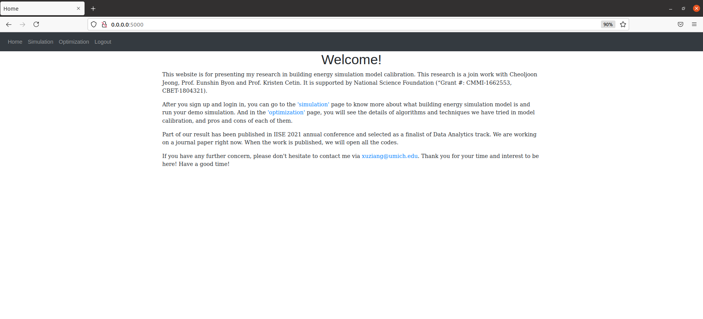
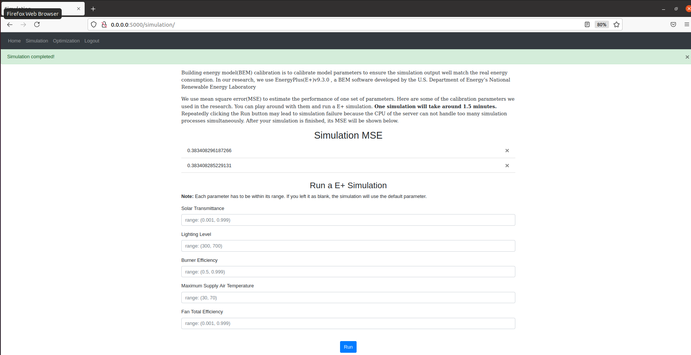
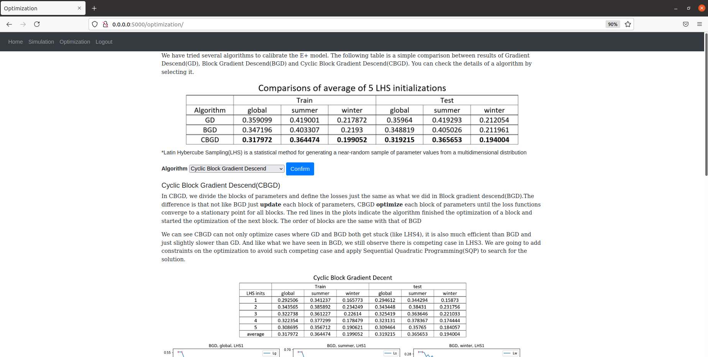

# BEM(building energy model)-SIM-APP

The is a web app presenting my research in BEM(building energy model) calibration.


You can play around with some parameters we used in the research and run your own BEM simulation.


And you check the algorithms that we have tried. There are detailed explainations of the ideas behind each algorithms and their pros and cons.


## 1. Setup & Installation with Docker(recommended)
Everything that this app needed has been dockerized with it.

### Build a docker image

```bash
sudo docker build -t [Your Preferred Image Name] .
```

### Run the image with port mapping
We need to map the docker container port to our local host port（any unoccupied port is fine, like 8080）, otherwise we won't be able to access the app. Here, the container port is 5000.

```bash
sudo docker run -p [Your host port]:5000 [Your Preferred Image Name]
```

### Viewing the App
Go to `https://0.0.0.0:[Your host port]`

## 2. Setup & Installtion with python

Make sure you have installed EnergyPlusV9.3.0 and Python 3.7 (other version of Python won't work).

```bash
git clone <repo-url>
```

```bash
pip install -r requirements.txt
```

### Running The App

```bash
python app.py
```

### Viewing The App

Go to `http://127.0.0.1:5000`
